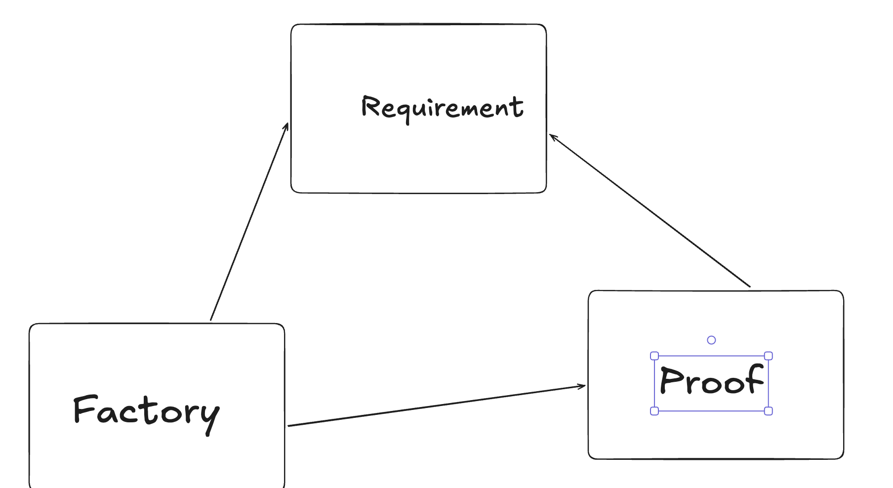

# 🛡️ AuthService Domain  
## The **Momo-Architecture** Standard

> **“A boolean is a guess. A Proof is a certainty.”**

---

## 📌 Overview

This repository contains the **Domain Layer** of an enterprise-grade **Authentication Microservice**, implemented using **Domain-Driven Design (DDD)** and **Clean Architecture** principles.

At its core is a custom architectural standard known as **Momo-Architecture** — a **Proof-Oriented, Capability-Based Security Model** designed to eliminate *implicit trust* from the domain.

Instead of relying on unchecked primitives (booleans, raw strings, timestamps), the domain operates exclusively on **certified proofs** that guarantee correctness, authorization, and origin at **compile time** and **runtime**.

---

## 🚀 Key Architectural Pillars

### 1️⃣ The Triple-Lock Handshake (1-1-1 Relationship)

Every Domain Aggregate is created or reconstituted through a strict **1-1-1 binding** between:

- **Requirement**  
  A capability-guarded *Vault* containing raw input (Schema or Proof).  
  Holds a **hard reference** to its authorized Factory.

- **Factory**  
  The **only** component permitted to unlock and consume a Requirement.

- **Proof**  
  A domain-certified receipt proving the Aggregate was created from a valid source.

> An Aggregate **cannot exist** without all three.



---

### 2️⃣ Proof-Oriented Design

In this domain, **state transitions emit certificates**.

Examples include:

- **Birth Proofs**
  - `UserRegistrationProof`
  - `LoginProof`

- **Lifecycle Proofs**
  - `SessionActiveProof`
  - `SessionDeactivationProof`
  - `TokenDeactivationProof`

These proofs are:
- Immutable
- Non-forgeable
- Observable by infrastructure layers
- Auditable by design

The domain does not “check flags” — it **verifies history**.


---

### 3️⃣ Agile Invariant Enforcement

Business rules are enforced at the **compiler level** using:

- Recursive generics
- Visibility-gated constructors
- Capability-restricted factories

If a developer attempts to:
- Create a `Session` without a `LoginProof`
- Reconstitute a `Token` without validated claims

➡️ **The code will not compile.**

This enables **fearless refactoring** of security-critical logic.

---

## Some Diagrams Used to help understand the domain
EERD 

UML

## 📂 Project Structure

```text
├── model/
│   ├── aggregates/      # Triple-Lock handshake implementations
│   │   ├── user/        # Identity aggregates
│   │   ├── session/     # Lifecycle & deactivation proofs
│   │   └── token/       # 3NF-aligned hierarchical tokens
│   ├── services/        # Credential & MFA validation gateway
│   ├── schemas/         # Persistence reconstitution specs
│   ├── mapping/         # Object ↔ schema transformation
│   ├── parser/          # JWT & opaque token parsing engines
│   └── valueobjects/    # Immutable domain primitives
├── ports/               # Infrastructure contracts
└── exceptions/          # Domain-specific error hierarchy
